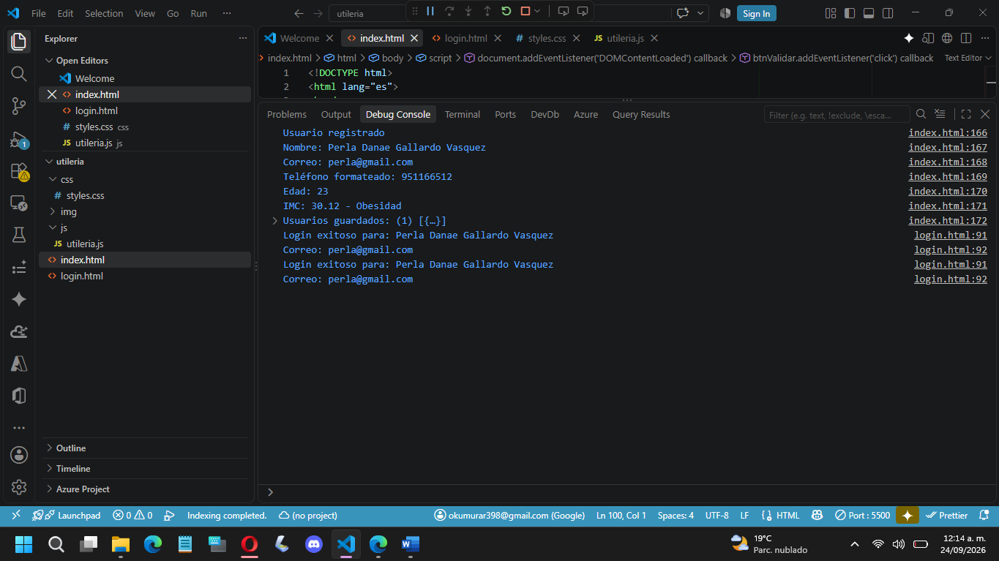
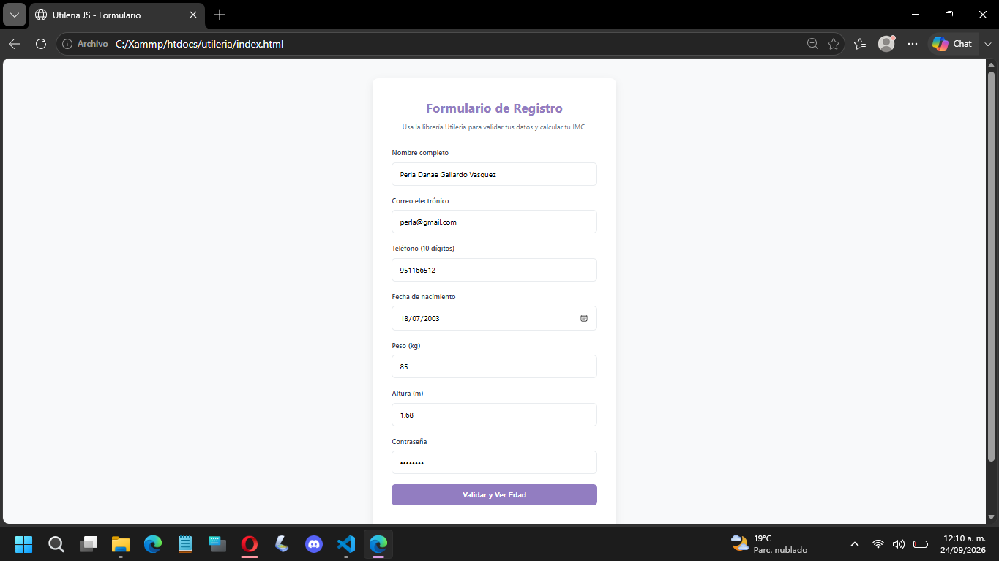
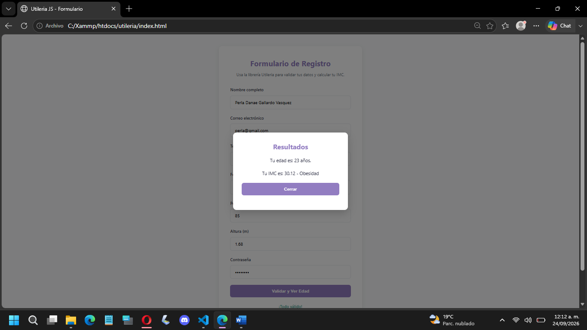
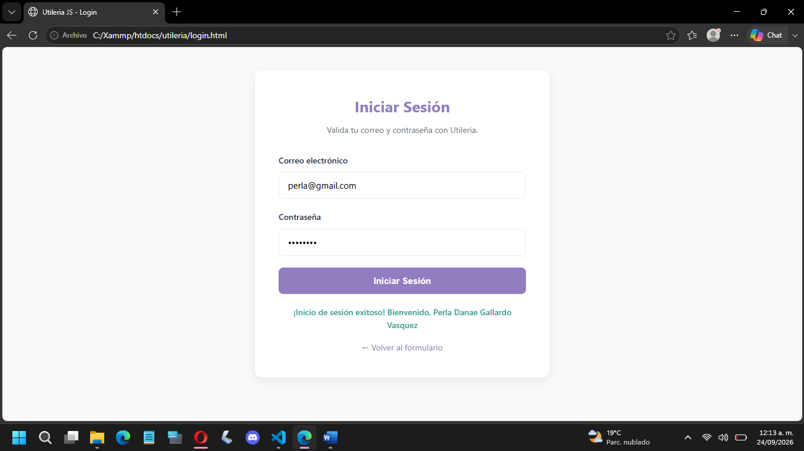
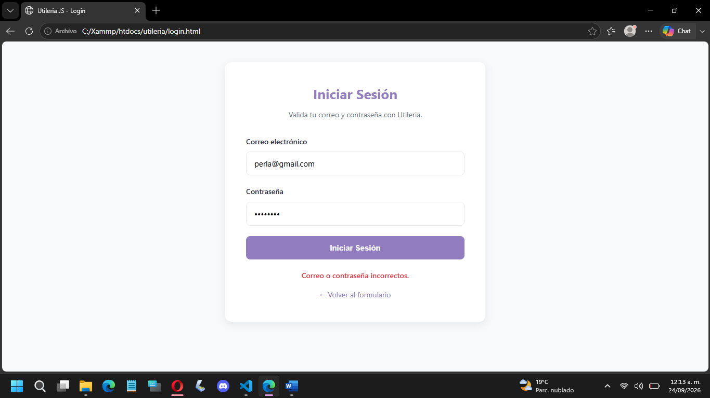

# Utileria JS

**Autor:** Gallardo Vasquez Perla Danae  
**Materia:** Programación Web  
**Repositorio:** [https://github.com/PerlaD391/Actividad_2](https://github.com/PerlaD391/Actividad_2)  
**Demo en vivo:** [https://perlad391.github.io/Actividad_2/](https://perlad391.github.io/Actividad_2/)

---

## ¿Qué problema resuelve?

**Utileria JS** es una librería ligera de validaciones y utilidades para formularios web, escrita en JavaScript puro (sin frameworks ni dependencias externas).

### El problema:
Cada vez que se construye un formulario de registro o login, los desarrolladores deben **escribir desde cero** las mismas validaciones: correo electrónico, contraseña segura, longitud de teléfono, cálculo de edad, etc. Esto genera **código repetido**, **errores** y **pérdida de tiempo**.

### La solución:
`Utileria JS` ofrece un conjunto de **8 funciones listas para usar** que resuelven las validaciones más comunes:

- Validar correo electrónico
- Validar que un texto solo tenga letras
- Validar longitud de números
- Calcular edad a partir de fecha de nacimiento
- Validar mayoría de edad
- Validar contraseñas seguras
- Formatear teléfonos (función propia)
- Calcular IMC con categoría (función propia)

---

##  Instalación

### Paso 1: Descarga o clona el repositorio

```bash
git clone https://github.com/tu-usuario/utileria.git
```

### Paso 2: Incluye la librería en tu HTML

```html
<script src="js/utileria.js"></script>
```

### Paso 3: ¡Listo para usar!

```javascript
Utileria.validarCorreo("correo@ejemplo.com");
```

---

##  Uso con ejemplos de código

### 1. `validarCorreo(correo)` → boolean

```javascript
console.log(Utileria.validarCorreo("juan@correo.com"));  // true
console.log(Utileria.validarCorreo("juan@correo"));      // false
```

### 2. `soloLetras(texto)` → boolean

```javascript
console.log(Utileria.soloLetras("Juan Pérez"));  // true
console.log(Utileria.soloLetras("Juan123"));     // false
```

### 3. `validarLongitud(numero, maxLongitud)` → boolean

```javascript
console.log(Utileria.validarLongitud("5512345678", 10));  // true
console.log(Utileria.validarLongitud("12345678901", 10)); // false
```

### 4. `calcularEdad(fechaNacimiento)` → number

```javascript
console.log(Utileria.calcularEdad("2000-05-15"));  // 25
```

### 5. `esMayorDeEdad(fechaNacimiento)` → boolean

```javascript
console.log(Utileria.esMayorDeEdad("2000-05-15"));  // true
console.log(Utileria.esMayorDeEdad("2010-05-15"));  // false
```

### 6. `validarPassword(password)` → boolean

```javascript
console.log(Utileria.validarPassword("Abc123!@"));  // true
console.log(Utileria.validarPassword("abc123"));    // false
```

### 7. `formatearTelefono(telefono)` → string *(Función propia)*

```javascript
console.log(Utileria.formatearTelefono("5512345678"));  // "55 1234 5678"
```

### 8. `calcularIMC(peso, altura)` → string *(Función propia)*

```javascript
console.log(Utileria.calcularIMC(70, 1.75));  // "22.86 - Peso normal"
console.log(Utileria.calcularIMC(90, 1.70));  // "31.14 - Obesidad"
```

---

##  Capturas de pantalla

### Captura 1: Validaciones en consola


### Captura 2: Formulario funcionando



### Captura 3: Login funcionando




---

## Video demo

[Ver video en YouTube](https://www.youtube.com/watch?v=5YU9u6w4CXo)

---

##  Estructura del repositorio

```
/utileria
├── README.md
├── index.html
├── login.html
├── /css
│   └── styles.css
├── /js
│   └── utileria.js
└── /img
    └── (capturas)
```

---

##  Lista de funciones

| # | Función | Tipo | Descripción |
|:---|:---|:---|:---|
| 1 | `validarCorreo(correo)` | Obligatoria | Valida formato de correo |
| 2 | `soloLetras(texto)` | Obligatoria | Valida que solo tenga letras |
| 3 | `validarLongitud(numero, max)` | Obligatoria | Valida longitud de un número |
| 4 | `calcularEdad(fecha)` | Obligatoria | Calcula edad exacta |
| 5 | `esMayorDeEdad(fecha)` | Obligatoria | Valida mayoría de edad |
| 6 | `validarPassword(password)` | Obligatoria | Valida contraseña segura |
| 7 | `formatearTelefono(telefono)` | Propia | Formatea teléfonos |
| 8 | `calcularIMC(peso, altura)` | Propia | Calcula IMC con categoría |

---

##  Licencia

Este proyecto es de uso libre para fines académicos y personales.

---

##  Autor

**Gallardo Vasquez Perla Danae**  
Estudiante de Ingenieria en sistemas computacionales
21160634@itoaxaca.edu.mx
